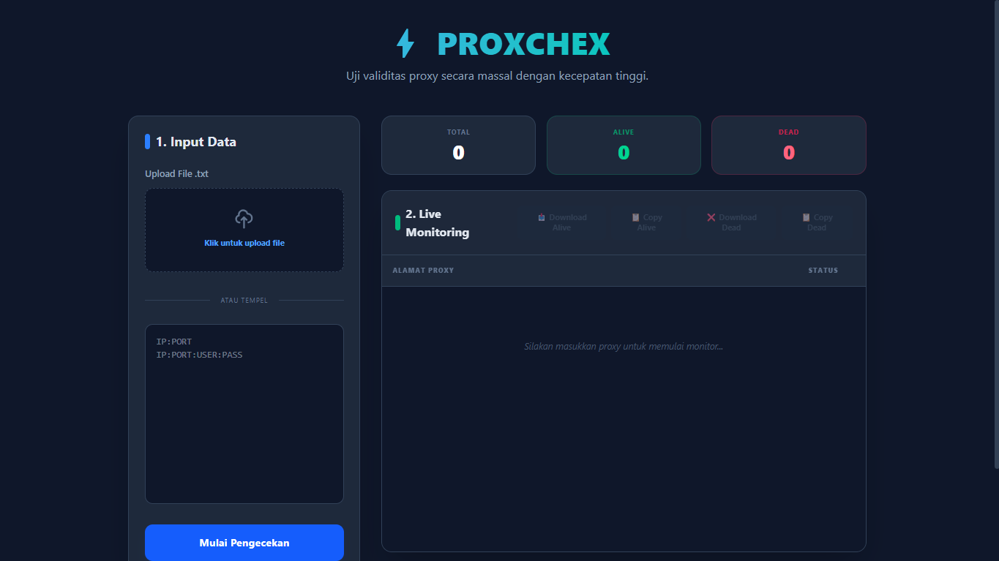

# PROXCHEK

Aplikasi berbasis Node.js untuk melakukan pengecekan daftar proxy secara otomatis.

---

## 🛠️ Prasyarat (Prerequisites)

Sebelum menjalankan project ini, pastikan di komputer kamu sudah terinstal:
- [Node.js](https://nodejs.org/) (Versi terbaru sangat disarankan)

---

## 📥 Cara Instalasi (Installation)

Karena folder `node_modules` tidak ikut di-upload ke GitHub, kamu perlu mengunduh ulang semua *dependencies* (*library*) yang dibutuhkan project ini (seperti `axios`, dll) dengan cara:

1. **Buka Terminal** di dalam folder project ini.
2. **Jalankan perintah sakti berikut:**
```bash
   npm install